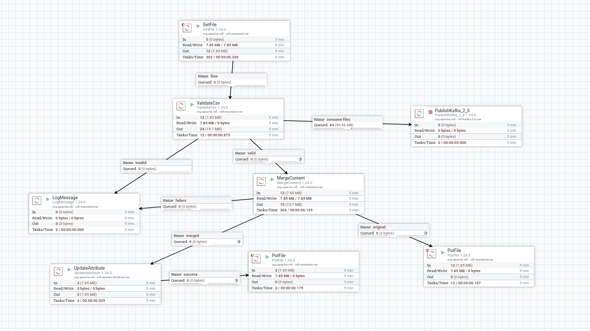
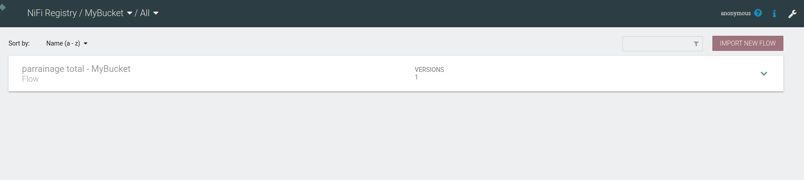
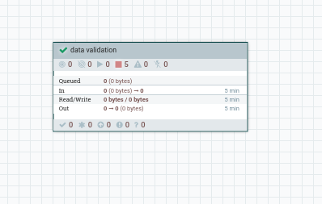
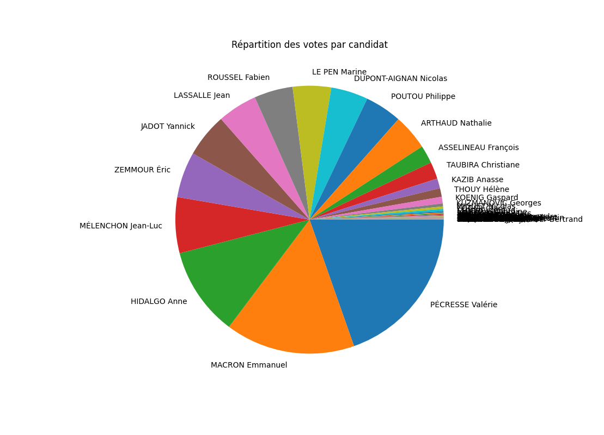
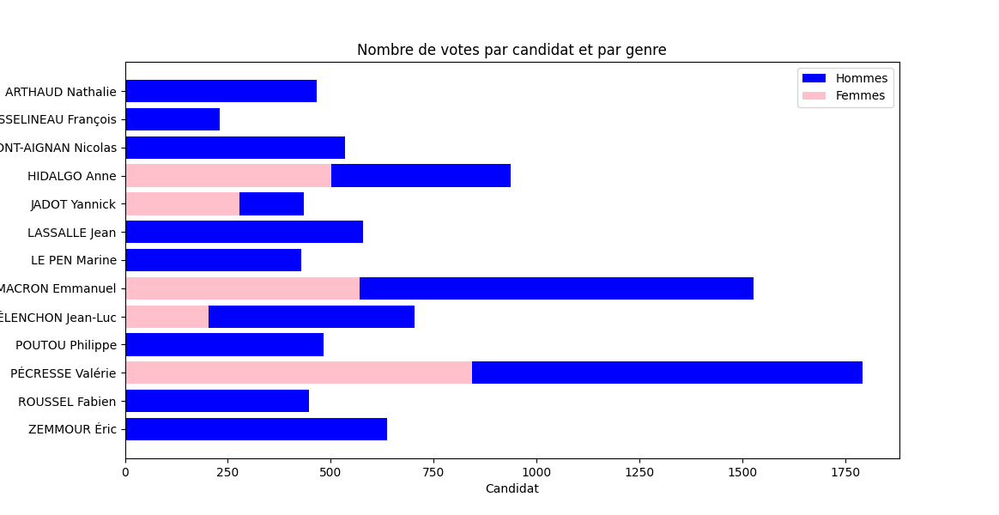
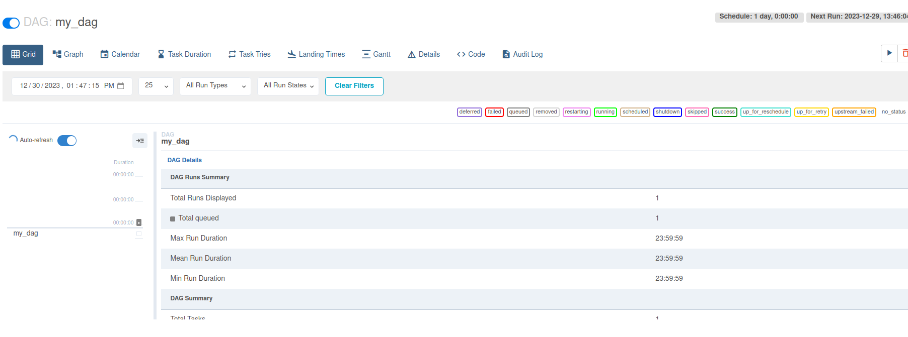

# Data_Pipeline_Project

## Introduction
Dans le cadre de notre projet pour le module Data Pipeline nous avons réalisé une étude portant sur des données politiques en vue des élections présidentielles 2022.

Le projet comporte 3 parties:

* Collecte des données.
* Traitement des données (mise en forme, nettoyage..).
* Orchestration et automatisation du Data Pipeline.

## Technologies
* Kafka
* Spark
* apache Nifi
* apache nifi-registry
* apache Airflow

## Collecte des données

Cette première étape est indispensable pour alimenter le pipeline de données en inputs.
Ci dessous l'illustrations du schéma réalisé avec Nifi.

on a commencer par un process **getfile** vers un process de **validationCSV** afin de valider les colonnes de nos fichiers. 
Une fois valider, on realise un process **MergeContent** afin de merger tout ces fichier en un seul vu leur taille minime et afin de faciliter leur utilisation en spark. Ce merge est un merge binaire, qui nous presente comme resultat les fichiers originaux qui sont en register au dossier via un process **PUTFile** et le fichier merged qui est renommer en **MergedData.csv** via un process **UpdateAttribute** et apres telecharger via un process **PutFile**.

Une controle de version sur le process nifi realise est assurer par nifi-registry, ci dessous une image sur le bucket realisé et sur le process nifi.

## Traitement des données

Une fois les données collectées, ous avons effectués plusieurs opérations moyennant principalement Pyspark sur les données collectés tel que:

* Suppression des doublons.
* Traitement des dates.
* Ajout de colonnes (Feature Engineering).
* Calcul d'agrégats.
* Realisation des plots d'analyse de données comme ci dessous.

## Orchestration et automatisation du Data Pipeline.

Dans le but d'automatiser notre flot de données, nous avons un DAG sur Airflow:

Il se déclenche chaque jour pour effectuer les traitements nécessaires à l'obtention et le traitement des données propres à chaque candidat.

